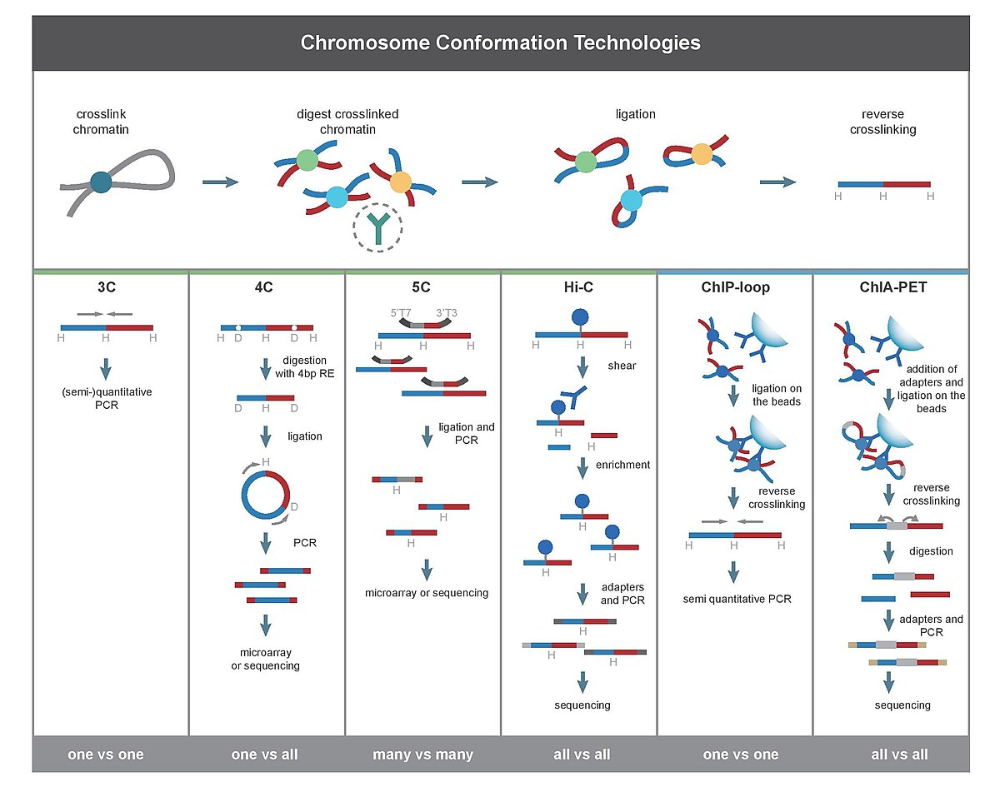
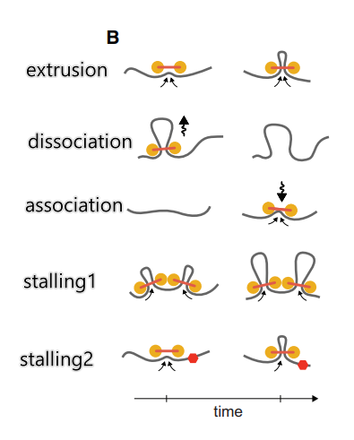
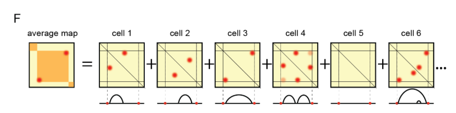
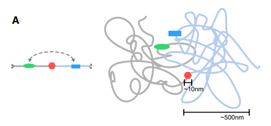
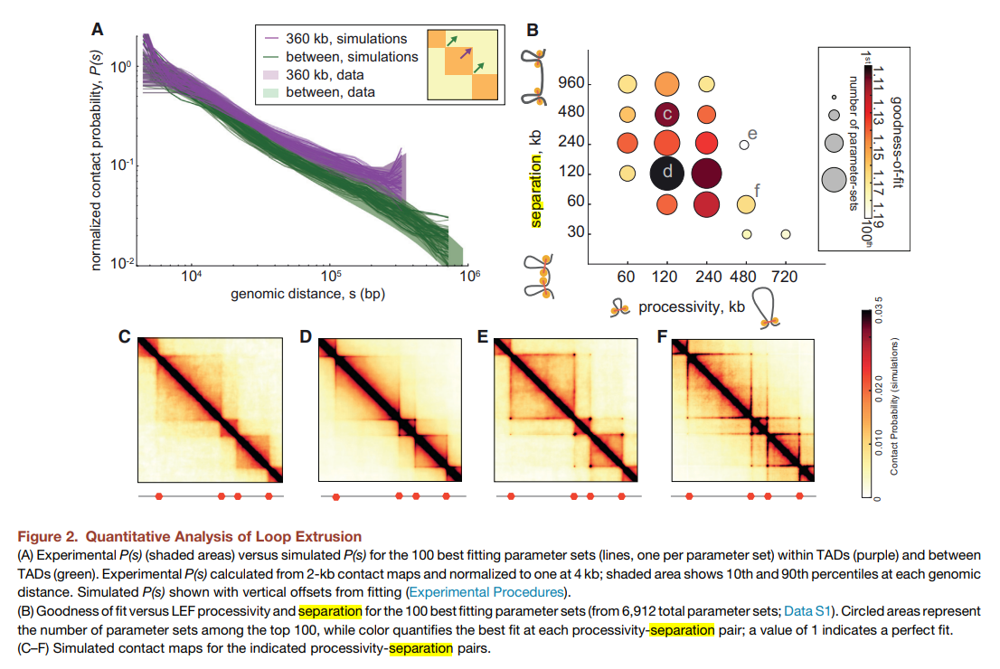
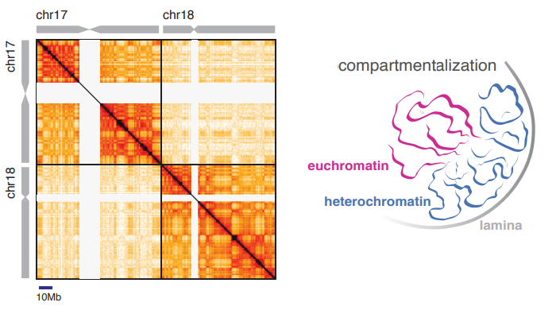

# Week 12: Chromosal organization through loop extrusion

## General idea

## Question 1: Chromatin conformation capture techniques

### How do they work in principle?

There are multiple 3C techniques but they all start with the same steps:

1. Formaldehyde crosslinking of DNA
2. Digestion of the crosslinked DNA with restriction enzymes
3. Proximity-based ligation of the digested DNA with adapters
4. Reversal of the crosslinking and
5. Sequencing of the ligation products

For Hi-C specifically:

1. Formaldehyde crosslinking of DNA
2. Digestion of the crosslinked DNA with restriction enzymes that generate 5' overhangs (e.g. HindIII)
3. Biotinylation of the mildly digested DNA using DNA polymerase I and biotinylated dNTPs (esp. dATP and dCTP)
4. Proximity-based ligation of the digested DNA using T4 DNA ligase (enabled by appropriate dilution)
5. Purification of biotin-labeled products and removal of unligated fragments using T4 DNA polymerase with 3'-5' exonuclease activity
6. DNA extraction, shearing by sonication and end repair (crosslinking reversal)
7. Biotin pull-down with streptavidin
8. PCR for library preparation, sequencing

### What are the data they produce? How are these data represented in the papers?

They all produce sequenced reads (of ligated fragments in vicinity, or potentially originated from distance genomic loci)

The raw reads are usually first mapped onto reference genome (some efforts for ligation junction identification and separate alignment required of course) and produce a BAM file. After quality control, the reference genome is usually divided into small regions (bins) that are used to generate a raw contact matrix by counting the number of paired-end reads inside each pair of bins (binning). After proper normalization, the contact matrix is used to generate a **contact frequency map (contact map)** that is used to visualize the data.

### On what genomic length scale are the structures of interest?

"sub-megabyte" (as is described in the paper)

The size of a TAD is usually several hundred kilobases.

## Question 2: Topologically associated domains (TADs)

### What are TADs? What features do they have in contact maps?

TADs are topologically associated domains, which are continuous regions of enriched contact frequencies on the chromosome.

They appear to be squares on the contact map, with usually 2-4 fold higher contact frequency, and are rather "self-interacting" and inslulated from the neighboring regions. However, they do not necessarily form a "checkerboard" pattern like A/B compartments do.

About 50% of the TADs revealed peaks of interaction frequency at the corners of the TADs.

### TADs are tranditionally thought of as static? What evidence is presented against that view?

1. There are not always corner peaks
2. End points are not stable
3. Pinch together the BE then we lose the block like structure

## Question 3: Simulation model in one dimension

### Describe the 1D model of loop extrusion. How are loops initiated? How do boundary elements define domains?

LEF translocation along a chromatin fiber was simulated on a 1D lattice, where each position was  characterized by the following parameters: **association (birth) probability**, **dissociation (death)  probability**, and **BE occupancy (stalling probability)**. 

Since the molecular mechanism of loop extrusion is not known, we model a LEF very generally as  **having two “heads”** connected by a linker, analogously to SMC protein complexes. Each head of a LEF  occupied one lattice position at a time, and no two heads could occupy the same lattice position except at birth events. At each time-step, each LEF head translocates to the neighboring lattice site, if that site  is not occupied or is not a boundary element (BE). If one head cannot translocate, the other head is  unaffected. At each time-step, a LEF dissociates with a probability equal to the maximum of the death  probabilities at the positions of the two heads of a LEF. For birth events, LEF heads were either started  on the same lattice site, or on adjacent lattice sites (if the site immediately to the right of a chosen site  was unoccupied) with 50% probability; this was necessary to avoid producing a checkerboard pattern  on the contact map at the monomer-scale, since the two heads of a LEF that has never been stalled  would otherwise always occupy either (even, odd), or (odd, even) positions.

### What aspects of the problem can be described in 1D, which ones require 3D?

The TAD is an average of experiments from many cells. This can be described very well in 1D model.

Insulation can be easily represented in 1D when the chromosome is drawn as a straight line with the insulating element between the enhancer and promoter. This creates an impression that insulation is relatively easy to achieve. However, intuition developed in 1D is misleading when applied to long flexible chromatin fibers in 3D, particularly because the **physical size of an insulating element (3-50nm) is much less than the size of a TAD (300-1000nm)**. For example, an enhancer and promoter separated by ~100kb (i.e. much greater than the persistence length of the chromatin fiber) can come in contact while still being spatially far from the insulating element in 3D.

Our simulations of BEs as bulky objects or locally very stiff regions argue that it is very difficult to insulate large genomic regions from each other by small factors that act locally. Indeed, our simulations suggest that a crucial mechanistic insight is often overlooked in illustrations of insulating elements.

## Question 4: Simulation model in 3D

### What are the elementary units of the 3D model?

A polymer of **10-nm monomers** (roughly three nucleosomes, or 600 bp) with excluded volume interactions and without topological constraints, subject to Langevin dynamics in OpenMM.

### How do LEF affect the polymer dynamics?

 LEFs impose **a system of bonds** on the polymer: a bound LEF forms a bond between monomers at the two ends of an extruded loop, and the bond is re-assigned to increasingly separated pairs of monomers as a LEF translocates along the chromosome; when a LEF unbinds, this bond is removed. BEs, which halt LEF translocation, were placed at fixed positions, with sequential separations of 180 kb, 360 kb, and 720 kb through the 10-Mb region

### What are the important parameters of the model?

* Separation: the distance between LEFs

  

* Processivity: the size of the loop that LEFs can introduce

  

## Question 5: TADs

### How does processivity and separation affect the contact maps and fit to the data?

* Separation: affect the size of the cliques, and the strength of the corner peak

* Processivity: affect the strength of the corner peak

### How does separation between LEFs affect the results?

### What is the loop coverage and the independent loop size in these regimes?

## Question 6: Corner peaks, loops and TADs

### Corner peaks seem to be an optional feature of TADs. What is their origin and interpretation?

### What parameters tend to produce more pronounced corner peaks?

High processivity.

### What features of TADs are missing in model with permanent loops?

Single strong loop only shown corner peaks 

## Question 7: The role of boundary elements (BE)

### BEs are not physical boundaries but stopping point for LEFs. How does this result in domains?

### What is the evidence for CTCF as boundary element?

CTCF is a similarly relevant molecular candidate for forming BEs. 

1. CTCF is enriched at TAD boundaries, its depletion makes TADs less prominent, and it has a relatively long residence time on chromatin. 
2. Bound CTCF interacts with cohesin in an orientation-dependent manner, similar to the interactions of shugoshin and sororin with cohesin. 
3. Inward-oriented CTCF sites are enriched at TAD boundaries and TAD corner-peaks. We note that any impediment to LEF translocation may serve as a BE. As follows, BEs in vivo may be formed by sites with high occupancy of proteins other than CTCF that block LEF translocation physically rather than through a specific interaction. For example, active promoters bound by transcription-associated machinery are prominent candidates, as they are particularly bulky and are enriched at TAD boundaries

### What evidence for directional BEs do they discuss?

## Question 8: Large scale organization

### What is the interpretation of the characteristic checkerboard pattern?

A/B compartmentalization.

Genomic intervals of different type exhibit differential affinities that cause them to segregate spatially in the nucleus. At the coarsest level, this can be broken down into two compartmental types: **A (active, magenta) and B (inactive, blue) chromatin**. 

> Schematic (right): A simplified annotation, where colored rectangles represent zones of homotypic contact enrichment and blank rectangles represent zones of heterotypic contact depletion. The colors in the margin represent the A/B identity along the chromosomes. The translucence of trans and inter-arm areas of the map represents the different baseline contact frequencies associated with territoriality of chromosomes and chromosome arms as seen in Hi-C on the left.

### What are the proposed mechanisms for this organization? How do they differ? Equilibrium/non-equilibrium? ATP dependent or not?

1. the heterochromatin-driven compartmentalization of chromatin: attraction among euchromatic regions, or among heterochromatic ones
2.  the active (ATP-dependent) loop extrusion that can be controlled by barriers at specific DNA positions and can in turn facilitate and control interactions between genomic elements
