# 221003 Paper review question

## Question 1

The first main ‘growth-law’ that is discussed in the paper is shown in **Figure 1A** and written in **equation (1)**. 

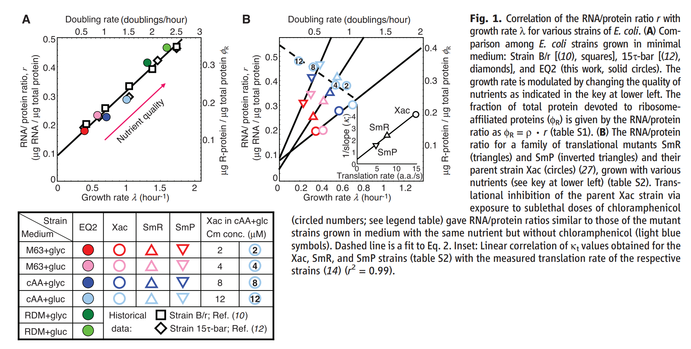

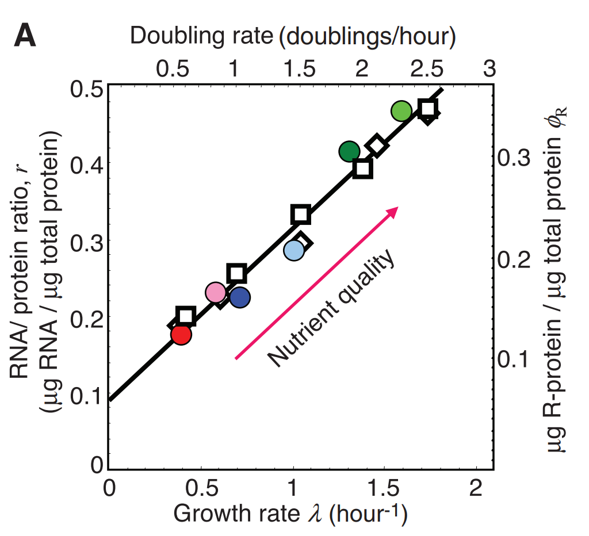

> Legend (A) Comparison among E. coli strains grown in minimal medium: **Strain B/r** [(10), **squares**], **15t-bar** [(12), **diamonds**], and **EQ2** (this work, **solid circles**). The growth rate is modulated by changing the quality of nutrients as indicated in the key at lower left. The fraction of total protein devoted to ribosome-affiliated proteins ($\phi_R$) is given by the RNA/protein ratio as $\phi_R = \rho · r$ (table S1).

It shows a linear relationship between two quantities. **Which are these quantities on the horizontal and vertical axis**? 

**What is being varied across these symbols/dots? **

There are both colored and non-colored symbols/dots. **What do they correspond to?** 

**What do the different colors correspond to?**

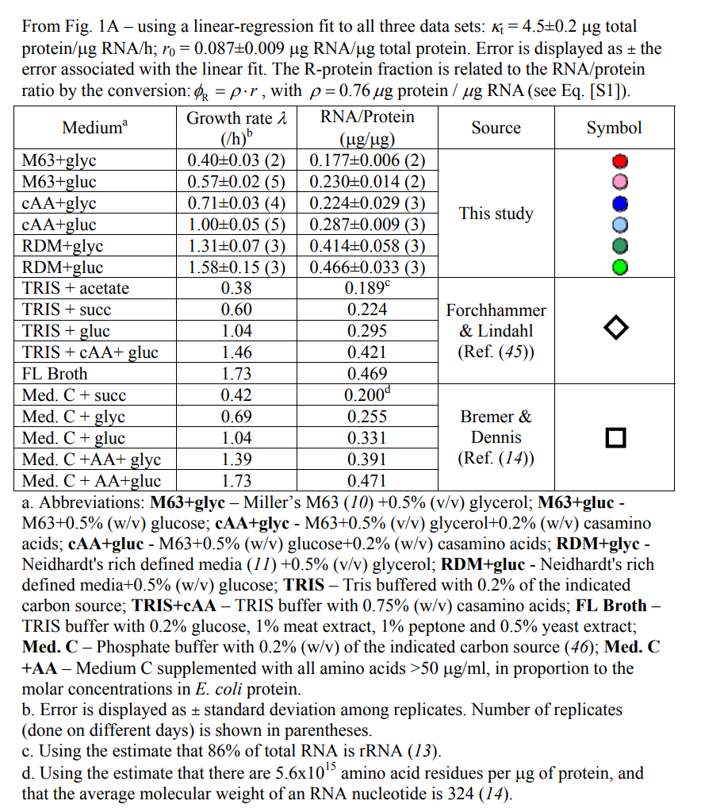

 The vertical axis has a scale both on the left and the right. What are these quantities? Apparently, these quantities are directly proportional to each other. **Does this make sense? What does it imply that these are directly proportional?** 

In particular it seems to imply something about the ratio between ribosomal RNA and total RNA in different growth conditions. **What does it imply?**

## Question 2

A key thing that we want to understand is the relationship (1), i.e. as cells grow in different environments at different rates, ==**the fraction of all proteins that are ribosomes increases linearly with the growth rate itself**==. In the theoretical analysis part of the supplementary materials one derivation is given for this observation. The key ingredients are that: 

1. When the cells are undergoing exponential growth at rate $\lambda$, the total amount of new protein that is created per unit time is $\lambda P$, where $P$ is the current total amount of protein. 
2. All new proteins are made by ribosomes. Thus, **the total amount of protein made per unit time is also given by the total number of ribosomes (or more precisely the total number of ribosomes that is actively translating) times the average translation rate.** 
3. Another key assumption is that the **average translation rate is the same** in all different conditions, i.e. independent of the growth-rate (Extra: Do you find *a priori* plausible? Is there a reason why evolution might have selected cells to always translate at the same rate, independent of growth-condition?). 

### **Use these assumptions to derive equation (1)**. 

When the cells are undergoing exponential growth at rate $\lambda$, the total amount of new protein that is created per unit time is $\lambda P$, where $P$ is the current total amount of protein:

$$ \Delta P = \lambda P $$

 $$ \Delta P = P_{ribo} \cdot \kappa_t $$

$$ \lambda P = P_{ribo} \cdot \kappa_t$$

$$\frac{\lambda}{\kappa_t} = \frac{P_{ribo}}{P}$$

$$m_R$$: mass per ribosome

$$OR$$: other RNAs

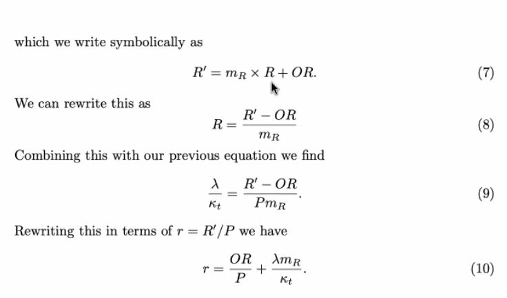

### Why is the inverse of the slope $ 1/\kappa_t $ proportional to the translation rate in this explanation? 

### What does the off-set $r_0$ correspond to?

"other RNA"

## Question 3

In figure 1B the authors now look at a set of ‘translational mutants’, i.e. in these mutants the ribosome moves at a different speed over the mRNAs. 

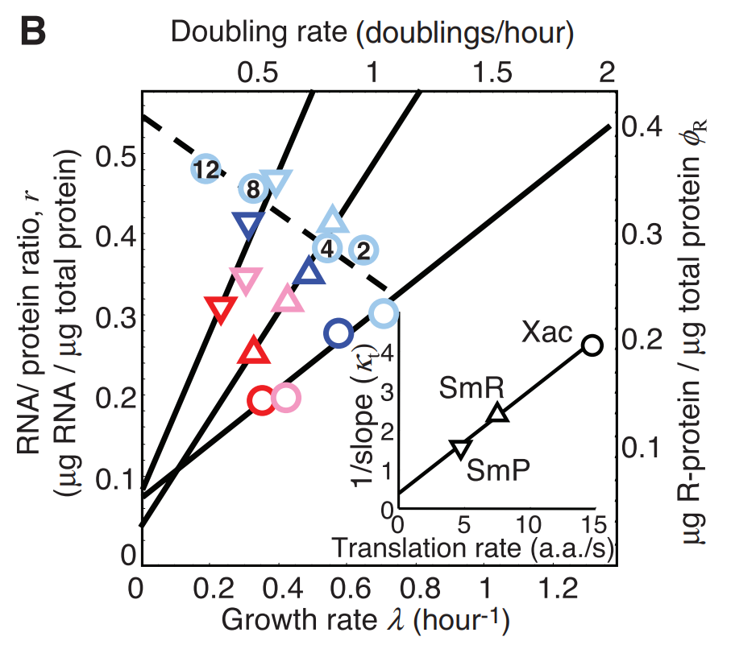

**What is plotted in figure 1B?** 

The RNA/protein ratio for a family of translational mutants SmR (triangles) and SmP (inverted triangles) and their parent strain Xac (circles) (27), grown with various nutrients (see key at lower left) (table S2). Translational inhibition of the parent Xac strain via exposure to sublethal doses of chloramphenicol (circled numbers; see legend table) gave RNA/protein ratios similar to those of the mutant strains grown in medium with the same nutrient but without chloramphenicol (light blue symbols). **Dashed line is a fit to Eq. 2. Inset**: Linear correlation of kt values obtained for the Xac, SmR, and SmP strains (table S2) with the measured translation rate of the respective strains (14) (r 2 = 0.99)

**What is being varied for the points that roughly fall onto the solid straight lines?** 

**What is shown in the inset?** 

**What do the three points in this inset correspond to?** 

**How does this fit with the ‘theory’ that we derived in question 2?** 

Finally, **what is being varied along the dotted line?**

Chloramphenicol stops translation

## Question 4

A ‘new’ linear growth law is identified from figure 1B and given in equation (2). Precisely **what in Figure 1B does this equation correspond to**? 

What is being varied that leads to different growth rates in this case, and what is being kept the same? More extensive data supporting this law is shown in Figure 2. 

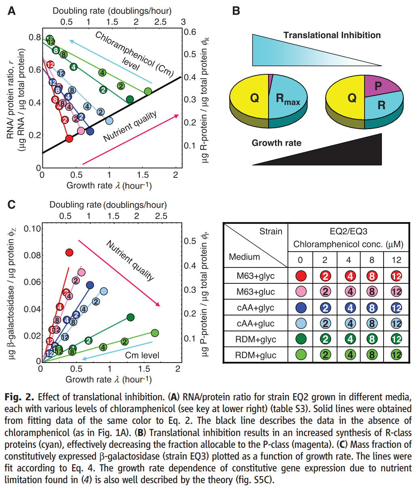

### Clearly the lines fitted to each set of points with a given color have different slopes $1/\kappa_n$. Thus, $\kappa_n$ is a quantity that is associated with the color of the dot. What is this? 

Translation rate slows down -- increase the number of ribosomes in the cell, to keep the translation rate stable

But the increase in ribosomes will cost you something

if the nutrient is really good, it will cost you less

### Note that in supplementary figure S3A a relationship is shown between $\kappa_n$ and the growth-rate $\lambda_0$ when there are no anti-biotics, i.e. without translation-rate inhibition, which may help interpret $\kappa_n$.

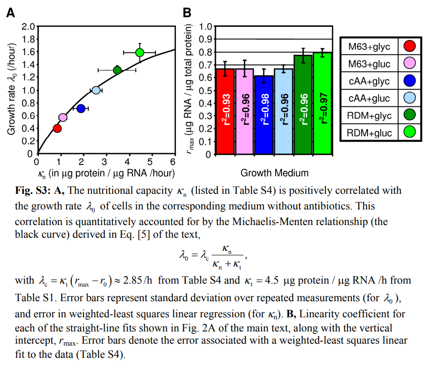

In rich growth condition, the $r_{max}$ will be slightly higher. So the $r_{max}$ is not totally constant, but they roughly go in the same direction...

### Does it matter to have the same $r_{max}$? 

As you increase ribosomes, some other groups of proteins (P class) go down, and the Q class cannot go down to 0. Interpretation for $r_{max}$ 

## Question 5

Figure S3B shows the fitted intercepts rmax for the solid lines shown in figure 2A, i.e. the rmax of equation (2). The findings suggest that rmax depends very little on the nutrients in which the cell is growing. 

How does $r_{max}$ relate to the fraction of all proteins in the cell that are associated with ribosomes? 

The authors now suggest that, because there is an $r_{max}$ corresponding to much less than 100% ribosomes, the set of proteins that are not ribosomes can be subdivided into 2 classes: a “class-Q” of proteins that always correspond to a fixed fraction of all proteins in the cell, and a “P-class” whose concentration goes down when the fraction of ribosomes (“R-class”) goes up. Is there any evidence that the authors provide that there is a class of proteins that are always present at a fixed fraction (φQ) of the total proteome? Hint: Look at supplementary figure S4.

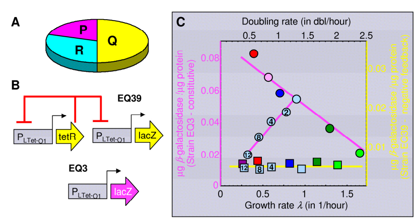

Make an artificial construct -- constitutive expressed

constitutive: as far as we know it is not regulated by anything, so it's bound by the RNApol only, not by anything else (the expression rate can vary but it's only related to RNApol)

 EQ39 is designed to be growth rate independent, the protein level will reach homeostasis. -- **autoregulated**

Unregulated proteins are in class P (which will be influenced by the increase of ribosomes)

Dilution! -- mathematically the same as degradation

**growing faster, diluted faster; level of protein systematically goes down because it cannot keep up with the dilution (green is rich in nutrition -- grows fast)**

## Question 6

The three classes of proteins together have to correspond to the entire proteome, i.e. φR + φQ + φP = 1. How is this used to derive equation (3). 

$$ \phi_P = \phi_R^{max} - \phi_R = \rho \cdot (r_{max} - r) $$

This is then combined with equation (2) to derive equation (4). 

$$r = r_{max} - \frac{\lambda}{\kappa_n}$$

$$\phi_P = \rho \frac{\lambda}{\kappa_n}$$

Again, it is important to check what is being varied in equation (4) and what is being kept the same. Can you give an intuitive explanation about what is happening?

## Question 7

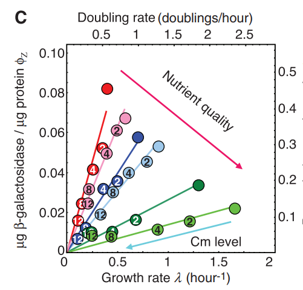

Figure 2C is a test of the prediction of equation (4). What is used to test this prediction? What is meant with a constitutive promoter? What is shown in figure S5B? What part of the equation (4) does this test

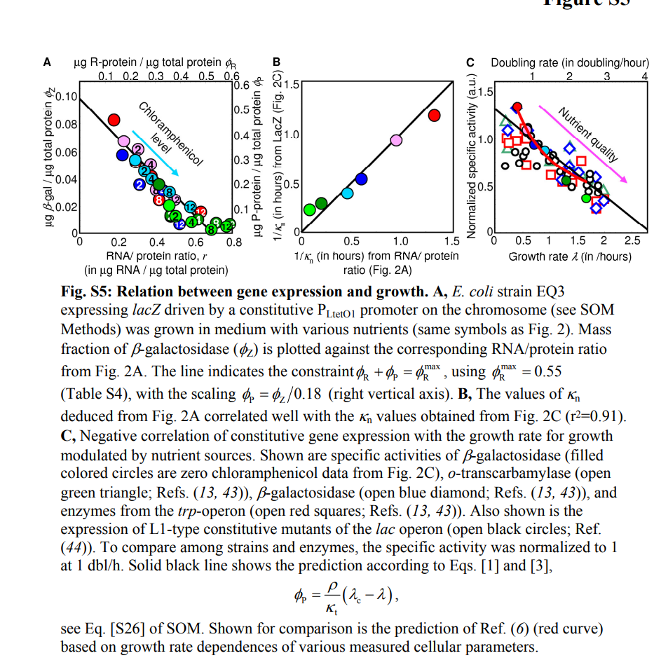

## Question 8

Figure 3A and the discussion of it in the text eventually reach up to the equation (5), which derives a general Michaelis-Menten relationship between growth rate and nutrient levels, i.e. exactly Monod’s equation. We want to derive this relationship here ourselves. For this we need to combine the three ‘laws’ that have been derived in the paper. We start with the first growth-law

$$r = r_0 + \frac{\lambda}{\kappa_t}$$

We can use the fact that RNA/protein ratio is directly proportional to the fraction φR of the proteome that is ribosomes, i.e.

$$\phi_R = \rho r$$

Using this we get the first growth-law in terms of ribosome fraction of the proteome

$$\phi_R - \phi_0 = \frac{\rho \lambda}{\kappa_t}$$

The second constraint we are going to use is that the fraction of ribosomes φR and the fraction in the P-class φP much sum up to a constant φ max R = 1 − φQ, i.e.

Combine these three equations to derive equation (5) of the paper. The way figure 3 presents this derivation is that κnφP is like a flux (material per unit time) of nutrients into basic ‘building blocks’ (e.g. amino acicds). The idea is that, the more proteins are expressed in class P, the bigger this flux, i.e. these are proteins that help turning nutrients into the basic building blocks for the cell. The parameter κn says something about the quality of the nutrients in the environment. That is, when κn is high, only a small number of proteins φP is needed to get a big flux. Besides the influx from nutrients to basic building blocks there is also an outflux from the basic building blocks into proteins. This outflux is proportional to how many ribosomes there are, times translation rate, i.e. κtφR. The idea is that the two fluxes need to be balanced, i.e. κnφP = κtφR. Combining this with the constraint that φP + φR = 1 − φQ (i.e. there is a fixed fraction φQ needed for ‘cell maintenance’) this then allows one to solve for both φP and φR in terms of κt and κn

$$ \lambda(\kappa_t, \kappa_n) =\lambda_c(\kappa_t) \cdot \frac{\kappa_n}{\kappa_t + \kappa_n} $$

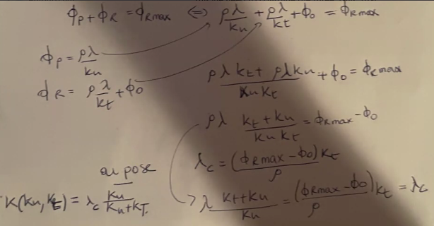

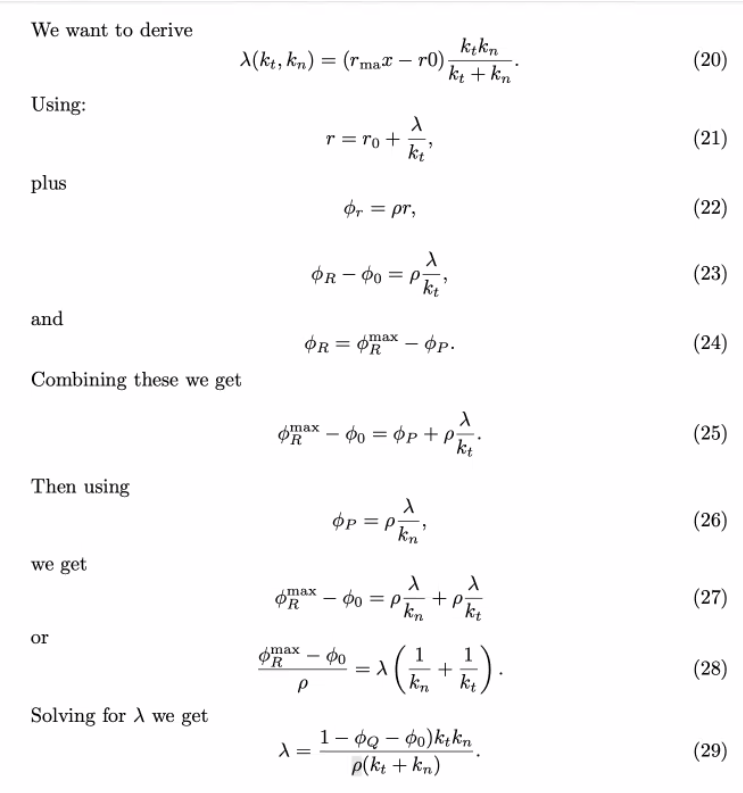

## Question 9

Finally, figure 4 investigates the effect on the growth-rate of uselessly expressing a gene (β-galactosidase). 

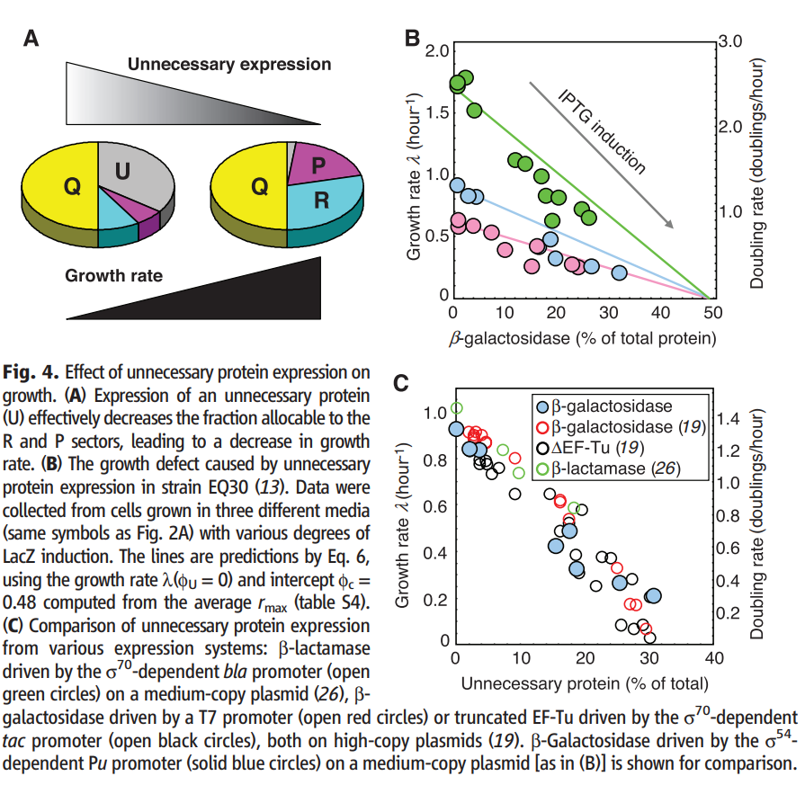

The authors claim that their theory (cumulating into equation (5) of the paper) predicts the effect on growth-rate without any free additional parameters. **What is the key idea to this prediction, i.e. what is the assumed only effect that the extra expression has?** 

Essentially just adds to $\phi_Q$

**Which value in the derivations of the previous question has now been changed?** 

Derive equation (6) of the paper from equation (5).

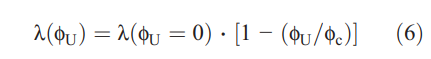

They use lacZ, and a promoter that can be induced with IPTG -- which is usually repressed by lac repressor. 