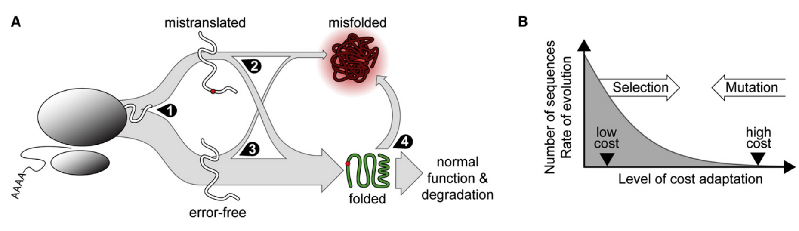

# Mistranslation-Induced Protein Misfolding as a Dominant Constraint on Coding-Sequence Evolution

## Question 1

On the first page the authors introduce the problem. The authors say that "functional importance" or the number of functionally important positions were thought to be the main determinants of the rate of evolution of a gene.

## 1.1. **What precisely is the argument here?**

> Because residues directly involved in protein function tend not to tolerate substitutions, it has long been hypothesized that slow-evolving proteins have more sites committed to functions, or are more functionally important.

## 1.2. What data speak against this argument?

Genome-scale data have revealed that measures of **functional importance**, such as essentiality or the number of protein-protein interactions are surprisingly **weak** correlates of evolutionary rate (Pal et al., 2006).

## 1.3. What has been recently observed to be the strongest correlate of evolutionary rate?

Genes with **high mRNA expression levels** encode **slow-evolving** proteins. Evidences in:

* Bacteria (Drummond et al., 2006; Rocha and Danchin, 2004)
* Yeast (Drummond et al., 2005; Pal et al. 2001)
* Algae (Popescu et al. 2006)
* Nematodes (Krylov et al, 2003)
* Plants (Ingvarsson, 2007; Wright et al. 2004)
* Fruit flies (Lemos et al., 2005)
* Mice (Subramanian and Kumar, 2004)
* Humans (Subramanian and Kumar, 2004)

## Question 2

Identifying a dominant cause in any observed process that is influenced by many causes boils down to quantifying the relative sizes of different influences. What is the **key rate** that suggests misfolding errors may be a large influence? Say in comparison to <u>errors in replication.</u>

## Answer

Missense errors in translation occur at rates of one per $10^3 –10^4$ codons, at an error rate of $5 \times 10^{-4}$ , **18%** of proteins expressed from an average length (400 codon) gene contain at least one **missense substitution**. Roughly 10%–50% of random substitutions disrupt protein function, and **most loss-of-function mutations appear to be loss-of-folding mutations**, also shown by large-scale folding and functional assays. Finally, misfolded proteins possess generic cytotoxicity (Bucciantini et al., 2002): Destabilized proteins expose natively buried hydrophobic residues that seek nonpolar surface area and find it in other destabilized proteins, causing protein-protein aggregation. At cell membranes, protein-membrane aggregation disrupts membrane integrity (Kourie and Henry, 2002; Stefani and Dobson, 2003) and with it crucial ionic balances (e.g., Ca2+) required for viability (Stefani, 2007). The expectation that ribosomal infidelity generates cytotoxic species suggests a general selective pressure for genetic adaptations that reduce these costs.

## Question 3

**Figure 1** shows the correlations of a number of features of genes across a range of species. In particular, the features whose correlations are measured are 

1. mRNA-level 
2. $dN$ 
3. $dS$ 
4. $F_{op}$ 
5. ts/tv-ratio

### 3.1. What is the definition of each of these quantities? 

1. mRNA-level: microarray-quantified mRNA expression level 
2. $dN$: nonsynonymous evolution rate (the number of nonsynonymous substitutions per nonsynonymous site)
3. $dS$: synonymous evolution rate (the number of synonymous substitutions per synonymous site)
4. $F_{op}$: the fraction of optimal codons per gene
5. ts-tv ratio: trasition(A-G or C-T)/transversion(all other changes) ratio

### 3.2. How is it measured for each species?

#### mRNA level

Used previously reported mRNA levels in papers publisehd before.

For *E. coli*, the geometric mean of 4 expression under aerobic growth were used.

#### $dN$, $dS$ and ts-tv ratio

Computed by maximum likelihood with `PAML` using a physical-sites definition  (Bierne and Eyre-Walker, 2003; Yang, 2006) operating on codons (codeml program)  with the F3×4 codon frequency model, one dN/dS ratio per branch (model 0), and an arbitrary seed ts/tv rate ratio of 3.4. 

Ts/tv ratios were computed by counting transitions  and transversions separating orthologous sequences, adding 1 to each (Laplace estimation), and taking their ratio.

#### $F_{op}$

We used published optimal codons for E. coli (Sharp and Li, 1987), yeast (Sharp and  Cowe, 1991), worm (Sharp and Bradnam, 1997), fly (Duret and Mouchiroud, 1999) and  human (Comeron, 2004). 

For mouse, optimal codons were defined as those corresponding to tRNAs with the highest gene counts in the set of 335 high-confidence tRNA genes identified by Waterston et al. (Waterston et al., 2002) (Supplementary  Table S2). 5′ adenine in the anticodon was presumed to be quantitatively modified to  inosine, which prefers to bind 3′ cytosine. 

>  ==abundance of tRNA is measured by the copies of tRNA genes in the genome== -> is this correct?

The fraction of optimal codons, $F_{op}$, was calculated as described (Duret and Mouchiroud, 1999). In human and mouse we used  the related measure $F_{op}GC$ (see Supplementary Results and Supplementary Figure  S7).

### 3.3. What is the overall correlation structure that is observed across most species? 

* Positive $dN$-$dS$ correlation
* Negative $dN$-ts/tv ratio correlation
* Negative $dS$-ts/tv ratio correlation

### 3.4. The authors state “Principal component analysis (PCA) of each organism’s correlation matrix confirmed that a single underlying component explains 36%–60% of the variance in all five analyzed variables”. What does this mean precisely?

The explained variance ratio is **the percentage of variance that is attributed by each of the selected components**.

==component loading: contribution of the measurement to the component==

### 3.5. Why is it surprising that the ts/tv-ratio correlates negatively with $dS$?

Because most substitutions occur in the third codon position and most trasition mutations in the third position are synonymous, the ts/tv ratio and $dS$ should be positively correlated. Yet it is negative in all organisms.

==synonymous mutations are mostly transitions==

## Question 4

### What is Akashi’s test? (You can simply Google it if necessary). 

In 1994, Hiroshi Akashi developed an elegant test for **translational accuracy selection on coding sequences** [[1](https://openwetware.org/wiki/Drummond:Akashi's_Test#bibkey_Akashi-Genetics-1994)]. **Some codons, particularly those corresponding to abundant tRNAs, are translated more accurately than others.** Under selection for translational accuracy, usage of those more-accurate synonymous codons will be favored at important (e.g., evolutionarily conserved) amino-acid sites, where translation errors could disrupt protein folding or function. At less-important (e.g., evolutionarily variable) amino-acid sites, errors are presumably more tolerable, and therefore more-accurate codons are less likely to be favored. Akashi's test asks:

1. How strong is the association between preferred codons and conserved amino acids, controlling for differences between amino acids and between genes?
2. How likely is that association to have occurred by chance?

### What is the significance of the outcome of this test? 

The selection on translational accuracy favors accurate codons at sites where substitutions are most harmful.

Optimal codons significantly associated with conserved sites, implying that selection has positioned optimal codons to reduce the consequences of translation errors.

Both the set of optimal codons and codon positions within genes interact to enhance translational accuracy. Likelihood of finding optimal codons at conserved sites is significantly higher

### Say that I wanted to argue that high-expressed genes use preferred codons because they need to be translated fast, and not because they need to be more accurate. Does the test address this?

The test's comparison of only those codons within a gene that encode instances of the same amino acid renders it immune to the biases arising from between-gene differences in expression level.

==If it is selected for translation speed, the preferred codon will be used throughout the highly expressed genes instead of only at conserved sites==

## Question 5

### Explain the misfolding hypothesis illustrated in figure 3. 

>  The evolutionary rate of a gene is the result of a balance of evolutionary and biophysical forces including that rate of errors in translation, the rate of misfolding, the expression level of the gene, the selective cost per misfolded protein, and the fraction of genetic mutations that either increase or decrease any of these parameters. How does this balance lead to the observed patterns? Does this imply that evolution is unable to affect certain parameters substantially? 

Misfolding costs can be reduced by 4 main **adaptations**:

1. Increasing the proportion of properly translated proteins (*translation accuracy*)
2. Decreasing the proportion of proteins that misfold or unfold because of mistranslation (*translation robustness*)
3. Decrease the proportion of properly translated proteins that fail to attain native structure (*decrease stochastic misfolding*)
4. Decrease the proportion of properly translated proteins that prematurely lose their structure (*decrease stochastic unfolding*)

For transcriptionally regulated genes, translation frequency increases with expression level, and the number of costly misfolded proteins generated by mistranslation or stochastic misfold also increases. Thus, **high-expression genes must display more adaptations** to overcome the increased cost of misfolding. However, highly adapted alleles are rare, so fewer mutations will lead to viable alternative alleles. So costly, **well-adapted genes will reject a higher proportion of mutations and evolve slowly**.

### What is the argument for why neurons would be particularly sensitive?

Neuronal tissues appear to be particularly sensitive to protein misfolding. Neurodegenerative diseases disproportionately involve protein misfolding and aggregation (Soto, 2003). The elaborately ramified **structures** and **extraordinary cell length** of many neurons confer a particularly **high surface-area-to-volume** ratio, **increasing the likelihood of disruptive protein-membrane interactions** (Kourie and Henry, 2002). **Limited neuronal turnover** makes **cell loss more probable, and more likely to be permanent**, under sustained chronic stress induced by misfolding.

## Question 6

To test if their hypothesis can explain all observed patterns, the authors turned to computer simulations. 

### How did these work?

We created a population of 1,000 simulated organisms with 37.5 kb genomes consisting of **500 coding nucleotide sequences (genes)** encoding 25-aa-polypeptides which fold according to a simple thermodynamic model. expressed at different levels and translated, with occasional codon-dependent translation errors, into computationally foldable model proteins. 

Translationally optimal codons were designated arbitrarily and were translated several-fold more accurately than the synonyms.

The population evolved subject to mutation, drift and selection with **fitness depending only on stable folding of the wild-type protein** and **the misfolded proteins generated by mistranslation**.

==Go codon by codon to determine whether they will be accurately translated or not==

### For example, how did the authors determine whether a particular sequence folds into the desired shape? 

Proteins that failed to fold in to the structure encoded by the native amino acid sequence with a free energy of unfolding above 5kcal/mol were designated misfolded.

### How did they decide when the simulation was done? 

### Do they discuss initial conditions and whether they matter?

## Question 7

>  The surprising negative correlation between ts/tv-ratio and $dS$ is by far largest at third positions in codons (that are most often synonymous) and weakest at second positions (which are essentially always nonsynonymous). 

### What explanation does this support? 

### So how in this explanation does the negative correlation arise?

We hypothesized that the novel and counterintuitive negative association of translation/transversion ratio with $dS$ was mediated by **synonymous codon choice**.

## Question 8

It seems that highly expressed genes acquire translation accuracy and translational robustness by different means. 

### How do these genes optimize these two independent contributions to minimizing mis-folding?

## Question 9

“Because we focus on patterns of covariation, our results do not imply that all variation in molecular evolution can be explained by protein misfolding or that protein function plays a negligible role.” 

### What is the purpose of this remark? Does it make sense to you?

## Question 10

### What is the nature of the cost? 

Cytotoxicity of misfolded proteins.

### The authors present several arguments that the costs must mainly be the cytotoxicity of the unfolded proteins and not the cost of producing and degrading these useless products. What are the arguments? Are you convinced?

